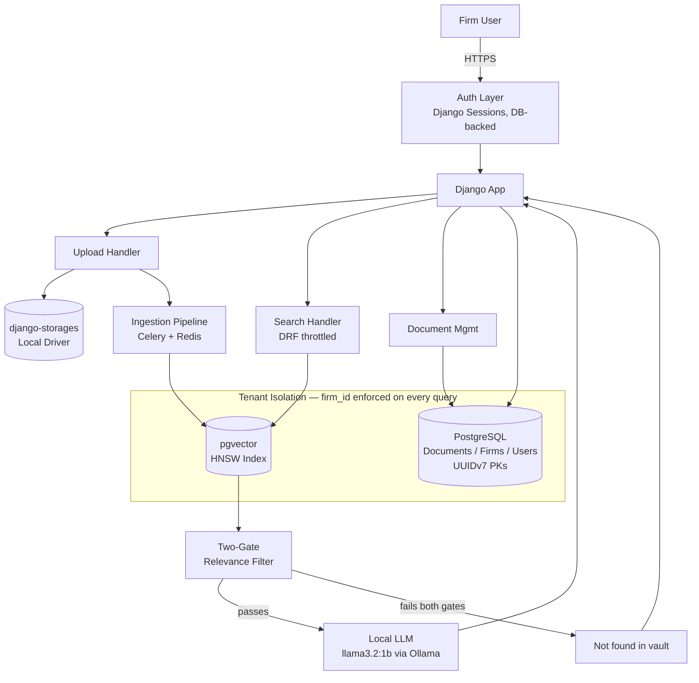
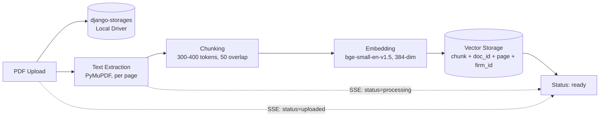
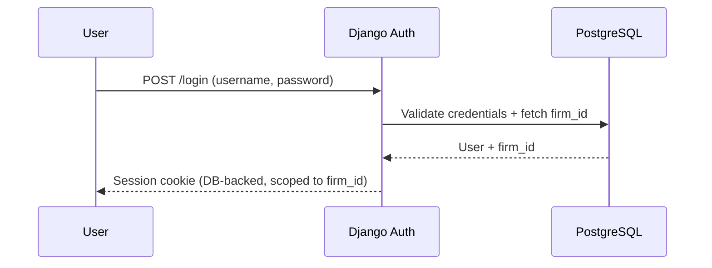
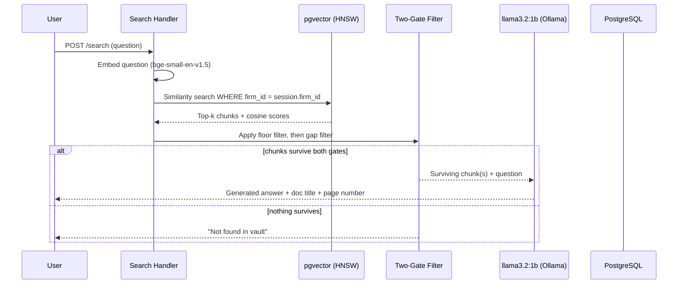

# LexVault — Architecture

## 1. Architectural Decisions

| Choice | Chose | Over | Reasoning |
|---|---|---|---|
| Primary keys | UUIDv7 | Sequential BIGSERIAL, UUIDv4 | Non-guessable across tenants (BIGSERIAL leaks record count / growth rate), while still preserving btree insert locality that random UUIDv4 destroys. |
| Multi-tenancy model | Shared schema + `firm_id` column | Schema-per-tenant, DB-per-tenant | Schema-per-tenant's migration overhead and DB-per-tenant's operational overhead aren't justified at 3-firm demo scale. A single schema with a mandatory `firm_id` filter is enough to prove the isolation *pattern* without the extra infra. |
| `firm_id` placement | Denormalized directly onto `chunk` and `search_query` | Reached only via join through `document`/`user` | The tenant filter has to sit on the same table that carries the vector index — filtering after a join means the HNSW index can't be used to prune the search space before the filter runs. |
| Auth | Django sessions | JWT, DRF Token auth | Single-server demo has no need for statelessness. JWT adds refresh/rotation/blacklist code that solves a multi-service problem this project doesn't have. |
| Session storage | Redis-backed | DB-backed | Already using Redis with Celery, so no config overhead and storage will be faster then sessions |
| Vector index | pgvector + HNSW | pgvector + IVFFlat, external vector DB (Pinecone/Weaviate) | IVFFlat needs a size-dependent `lists` parameter retrained as data grows — a tuning problem irrelevant at 3-PDF scale. An external vector DB adds a whole extra service for no retrieval-quality gain here. |
| PDF extraction | PyMuPDF (fitz) | pdfplumber, pypdf | Citation accuracy depends on precise page-to-text mapping; PyMuPDF is fastest and most accurate at exactly that, where pypdf has known text-order bugs and pdfplumber is slower at scale. |
| Chunking strategy | Fixed-size overlapping tokens (300–400 tokens, 50 overlap) | Semantic/paragraph-based chunking, larger chunks (800/100) | Fixed-size chunking gives predictable, testable boundaries — needed for the 90% citation-accuracy proof metric. Staying under bge-small's 512-token limit (rather than maxing it out) leaves headroom if query-instruction prefixing is added later. Semantic chunking was rejected for now because PDF layout inconsistency makes paragraph detection unreliable across the 3 demo documents. |
| Embedding model | bge-small-en-v1.5 (33M params, 384-dim) | nomic-embed-text, mxbai-embed-large, all-MiniLM-L6-v2 | Best performance-to-size ratio of the tiny models — punches above its weight on retrieval benchmarks while staying small enough to run on CPU with no GPU dependency, matching the fully-local architecture. |
| Answer generation | Local LLM — llama3.2:1b via Ollama | Extractive-only (no LLM), hosted API (OpenAI/Claude) | Extractive answers ("here's the matching passage") don't demonstrate synthesis and read as a weaker demo. A hosted API gives the best quality but breaks the fully-local, zero-marginal-cost story the rest of the stack is built around. A small local model keeps the entire pipeline — embedding *and* generation — running offline. |
| Not-found / relevance filter | Two-Gate Adaptive Context Selection (fixed floor + relative gap) | Fixed threshold alone, relative gap alone | A fixed floor alone wastes context on redundant chunks when one perfect match exists. A relative gap alone fails on off-topic questions — two equally-irrelevant low scores can still pass a small-gap test (the "crowded space" problem). Chaining both gates fixes each other's blind spot. |
| Live status delivery | SSE via Django's native `StreamingHttpResponse` | Polling, WebSocket, django-eventstream, Django Channels | Status updates are one-directional (server → client), which is exactly what SSE is for, over plain HTTP. Polling wastes requests and adds latency; WebSocket/Channels solve a bidirectional problem this project doesn't have and require moving to ASGI. |
| Background processing | Celery + Redis | Django-Q, synchronous (no queue) | Matches the stack already proven in production work (Royal Land, Dreamland PMS). Synchronous processing was rejected outright — it would block the request during ingestion, which directly breaks the "processing status" user story. |
| File storage | django-storages, Local filesystem driver | MinIO/S3-compatible | Keeps the same storage *abstraction* used in production (swap one config value to move to S3/MinIO later) without running an extra service for a 3-PDF portfolio demo. |
| Rate limiting | DRF throttling classes | django-ratelimit, custom middleware | Built into DRF already, and rate limiting is only needed on the search endpoint — a view-level throttle class is the smallest amount of code that solves exactly that, no new dependency. |
| Frontend | Django templates + HTMX | React (separate app), Django templates + vanilla JS | HTMX pairs naturally with SSE for live status updates with minimal JS. A separate React app adds cross-origin auth and build tooling that buys visual polish at the cost of ship time. |
| Testing | pytest + pytest-django | Django's built-in unittest | Cleaner fixtures and parametrization matter here specifically for testing tenant-isolation edge cases and threshold-filter logic across many score combinations. |
| Deployment | Oracle Cloud VPS | Railway/Render, local-only | Reuses ops experience already built on Royal Land (nginx/gunicorn/Docker) and produces a real deployed demo link, which local-only can't offer. |

---

## 2. System Overview

---

## 3. Ingestion Pipeline (detailed)

**Notes:**
- `firm_id` is written onto the chunk row at ingestion time — isolation is enforced at write, not bolted on at query time.
- Celery worker owns extraction → chunk → embed → store as one task chain, with SSE pushing each stage transition to the client as it completes.

---

## 4. Request Flow — Login

## 5. Request Flow — Search

---

## 6. Component Responsibilities

| Component | Responsibility |
|---|---|
| Auth Layer | Authenticate user, attach `firm_id` to DB-backed session |
| Upload Handler | Accept PDF, store via django-storages, enqueue Celery task |
| Ingestion Pipeline | Extract (PyMuPDF) → chunk → embed (bge-small) → store, firm-scoped, SSE status |
| Search Handler | Embed query, retrieve, throttle via DRF, apply Two-Gate filter |
| Two-Gate Filter | Fixed floor kills noise; relative gap trims redundant chunks |
| Local LLM | Generates final answer from surviving chunk(s), fully offline |
| Document Mgmt | List/delete documents, firm-scoped |
| Tenant Isolation | Cross-cutting: `firm_id` denormalized onto every vector-bearing table |
| Rate Limiting | DRF throttle class on search endpoint |