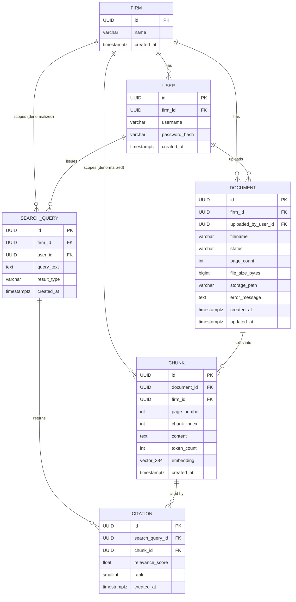

# LexVault — Schema Document

**Entities:** Firm, User, Document, Chunk, SearchQuery, Citation. Six tables, no more — anything not listed here is out of scope per `01_mvp_scope.md`.

---

## 1. Schema-Level Decisions

| Choice | Chose | Over | Reasoning |
|---|---|---|---|
| Primary keys | UUIDv7 (fall back to v4 if tooling is inconvenient) | BIGSERIAL, UUIDv4 | BIGSERIAL is sequential — a bug in one endpoint's tenant filter becomes exploitable by simple ID enumeration. UUIDs remove that failure mode structurally instead of relying on every query getting the filter right. v7 over v4 is a locality nicety, not a security decision. |
| Status fields (`document.status`, `search_query.result_type`) | VARCHAR + CHECK constraint | Native Postgres ENUM | `ALTER TYPE ... ADD VALUE` historically can't run inside a transaction and fights Django migrations. VARCHAR + CHECK matches Django's `TextChoices` pattern directly, and a `failed` status getting added mid-build (once error handling gets real) is then a normal migration, not a type-system fight. |
| `firm_id` placement | Denormalized directly onto `chunk` and `search_query` | Reached only via join through `document`/`user` | The tenant filter is the single most security-critical predicate in the system. It has to sit on the same table as the vector index so HNSW can prune before the filter runs, and so a future Postgres Row-Level Security policy can be a one-line `USING (firm_id = current_setting('app.firm_id'))` with no join. |
| Embedding model | bge-small-en-v1.5, 384-dim, self-hosted via sentence-transformers | bge-base-en-v1.5 (768-dim), OpenAI text-embedding-3-small (1536-dim), text-embedding-3-large (3072-dim) | This is evaluated on retrieval correctness and architecture, not embedding sophistication — the proof metric (90% citation accuracy, 20 questions, 3 PDFs) doesn't need a bigger model. Self-hosted means no API key, no per-call cost, no external dependency to explain away if the demo runs offline in an interview. Upgrading to bge-base later is a column-width migration, not an architecture change. |
| Vector index | pgvector + HNSW, cosine distance | pgvector + IVFFlat | IVFFlat needs a `lists` parameter tuned to row count and works best after `ANALYZE` on representative data — awkward and under-tuned at a few thousand demo rows. HNSW has no dataset-size-dependent parameter, gives better out-of-the-box recall, and needs no migration if the vault grows past demo size. |
| ON DELETE strategy | Cascade downward, restrict upward | Cascade everywhere / restrict everywhere | General rule: cascade through anything with no independent meaning without its parent (Chunk without Document, Citation without SearchQuery/Chunk). Restrict upward through anything that would silently orphan data with no delete workflow to handle it — there's no user-delete story in the MVP, so User deletion isn't a real path yet. |

---

## 2. Tables

### Firm
Tenant root. No FKs.

| Column | Type | Constraints |
|---|---|---|
| `id` | UUID | PK, default `uuid_generate_v7()` |
| `name` | VARCHAR(255) | NOT NULL |
| `created_at` | TIMESTAMPTZ | NOT NULL, DEFAULT now() |

---

### User
Belongs to exactly one Firm.

| Column | Type | Constraints |
|---|---|---|
| `id` | UUID | PK |
| `firm_id` | UUID | NOT NULL, FK → `firm(id)` ON DELETE CASCADE |
| `username` | VARCHAR(150) | NOT NULL |
| `password_hash` | VARCHAR(255) | NOT NULL |
| `created_at` | TIMESTAMPTZ | NOT NULL, DEFAULT now() |

**Constraints:** `UNIQUE (firm_id, username)` — unique per firm, not global. Firms are seeded independently with no shared admin workflow, so two firms each having an `admin` user is expected, not a collision.

**Indexes:** `idx_user_firm ON user (firm_id)` — Postgres only auto-indexes the referenced PK side of an FK, not this side.

---

### Document
Belongs to one Firm, uploaded by one User.

| Column | Type | Constraints |
|---|---|---|
| `id` | UUID | PK |
| `firm_id` | UUID | NOT NULL, FK → `firm(id)` ON DELETE CASCADE |
| `uploaded_by_user_id` | UUID | NOT NULL, FK → `user(id)` ON DELETE RESTRICT |
| `filename` | VARCHAR(255) | NOT NULL |
| `status` | VARCHAR(20) | NOT NULL, DEFAULT `'uploaded'`, CHECK (`status IN ('uploaded','processing','ready','failed')`) |
| `page_count` | INTEGER | NULL, CHECK (`page_count IS NULL OR page_count >= 0`) |
| `file_size_bytes` | BIGINT | NOT NULL, CHECK (`file_size_bytes > 0`) |
| `storage_path` | VARCHAR(500) | NOT NULL |
| `error_message` | TEXT | NULL |
| `created_at` | TIMESTAMPTZ | NOT NULL, DEFAULT now() |
| `updated_at` | TIMESTAMPTZ | NOT NULL, DEFAULT now() |

**On `uploaded_by_user_id` delete:** RESTRICT. No user-deletion story exists in the MVP — this just avoids building undefined orphan behavior for a path that isn't a feature yet.

**Indexes:**
- `idx_document_firm ON document (firm_id)`
- `idx_document_firm_status ON document (firm_id, status)` — supports the document list view, which is always firm-scoped and often filtered/sorted by status during processing.

---

### Chunk
Belongs to one Document; `firm_id` denormalized (decision above).

| Column | Type | Constraints |
|---|---|---|
| `id` | UUID | PK |
| `document_id` | UUID | NOT NULL, FK → `document(id)` ON DELETE CASCADE |
| `firm_id` | UUID | NOT NULL, FK → `firm(id)` ON DELETE CASCADE — denormalized |
| `page_number` | INTEGER | NOT NULL, CHECK (`page_number > 0`) |
| `chunk_index` | INTEGER | NOT NULL, CHECK (`chunk_index >= 0`) |
| `content` | TEXT | NOT NULL, CHECK (`length(content) > 0`) |
| `token_count` | INTEGER | NOT NULL, CHECK (`token_count > 0`) |
| `embedding` | VECTOR(384) | NOT NULL — bge-small-en-v1.5 |
| `created_at` | TIMESTAMPTZ | NOT NULL, DEFAULT now() |

**Constraints:** `UNIQUE (document_id, chunk_index)` — two chunks can't claim the same position in the same document.

**Indexes:**
- `idx_chunk_embedding ON chunk USING hnsw (embedding vector_cosine_ops)`
- `idx_chunk_firm_document ON chunk (firm_id, document_id)` — supports the tenant filter and cascade-cleanup lookups on document delete.

---

### SearchQuery
Belongs to one Firm (denormalized) and one User.

| Column | Type | Constraints |
|---|---|---|
| `id` | UUID | PK |
| `firm_id` | UUID | NOT NULL, FK → `firm(id)` ON DELETE CASCADE — denormalized |
| `user_id` | UUID | NOT NULL, FK → `user(id)` ON DELETE CASCADE |
| `query_text` | TEXT | NOT NULL, CHECK (`length(query_text) > 0`) |
| `result_type` | VARCHAR(10) | NOT NULL, CHECK (`result_type IN ('found','not_found')`) |
| `created_at` | TIMESTAMPTZ | NOT NULL, DEFAULT now() |

**On `user_id` delete:** CASCADE — unlike Document's RESTRICT on the uploader. A query log has no independent value once its owning user is gone, and audit logging is explicitly out of scope.

**`result_type` stored, not derived:** the proof metric needs a fast `GROUP BY result_type`; deriving it from Citation existence on every read would mean a join + count for the one number this project exists to report.

**Indexes:** `idx_searchquery_user_created ON search_query (user_id, created_at DESC)` — what rate limiting actually queries: rows for this user in the last N seconds.

---

### Citation
Belongs to one SearchQuery and one Chunk.

| Column | Type | Constraints |
|---|---|---|
| `id` | UUID | PK |
| `search_query_id` | UUID | NOT NULL, FK → `search_query(id)` ON DELETE CASCADE |
| `chunk_id` | UUID | NOT NULL, FK → `chunk(id)` ON DELETE CASCADE |
| `relevance_score` | FLOAT | NOT NULL, CHECK (`relevance_score >= 0 AND relevance_score <= 1`) |
| `rank` | SMALLINT | NOT NULL, CHECK (`rank >= 1`) |
| `created_at` | TIMESTAMPTZ | NOT NULL, DEFAULT now() |

**Constraints:**
- `UNIQUE (search_query_id, chunk_id)` — a chunk can't be cited twice for the same query.
- `UNIQUE (search_query_id, rank)` — ranking within a query's results is unambiguous.

**On `chunk_id` delete:** CASCADE. RESTRICT would mean a document can never be deleted once it's been searched (contradicts the delete-document story outright). SET NULL leaves a citation row pointing at nothing, useless for rendering. CASCADE is the only option that doesn't break something else.

**Indexes:**
- `idx_citation_query ON citation (search_query_id)`
- `idx_citation_chunk ON citation (chunk_id)`

---

## 3. All Indexes

```sql
CREATE INDEX idx_user_firm            ON "user" (firm_id);
CREATE INDEX idx_document_firm        ON document (firm_id);
CREATE INDEX idx_document_firm_status ON document (firm_id, status);
CREATE INDEX idx_chunk_embedding      ON chunk USING hnsw (embedding vector_cosine_ops);
CREATE INDEX idx_chunk_firm_document  ON chunk (firm_id, document_id);
CREATE INDEX idx_searchquery_user_created ON search_query (user_id, created_at DESC);
CREATE INDEX idx_citation_query       ON citation (search_query_id);
CREATE INDEX idx_citation_chunk       ON citation (chunk_id);
```

Every firm-scoped table gets an explicit `firm_id` index by hand — Postgres only auto-indexes the PK side of an FK relationship, not the FK column itself.

---

## 4. ERD

